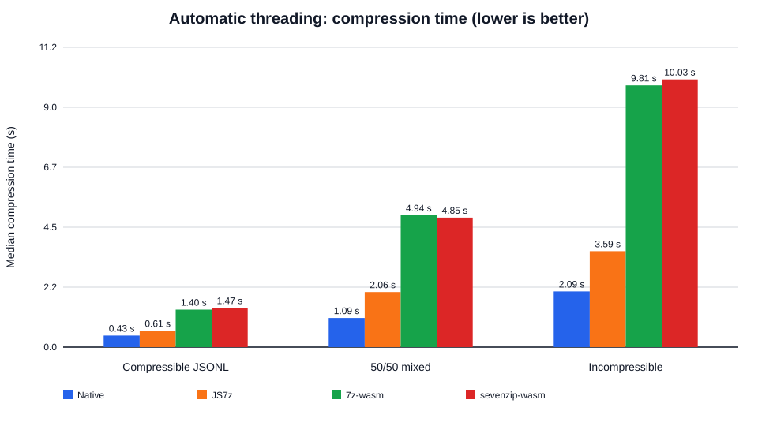
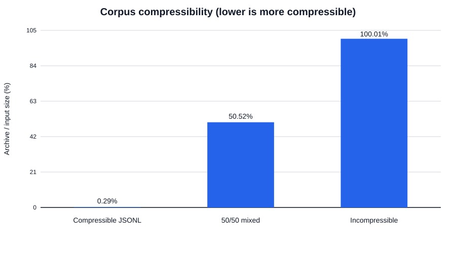
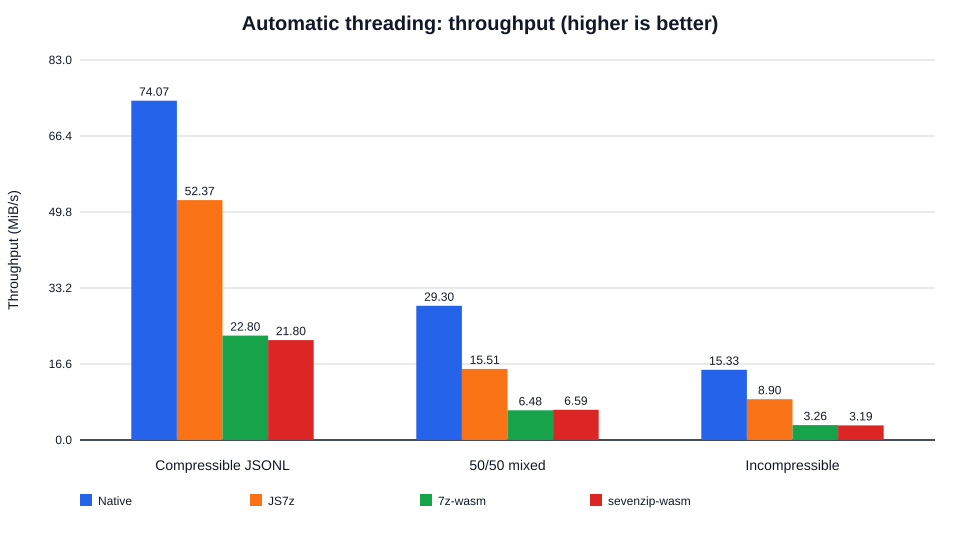
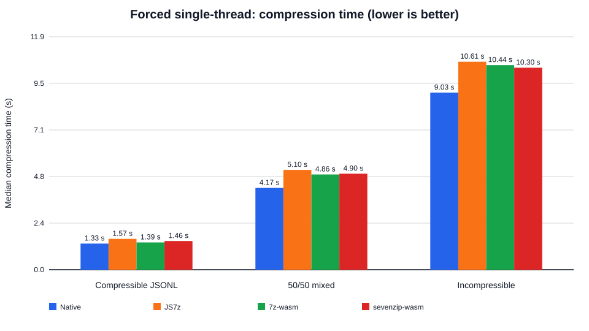

# 7-Zip JavaScript/WASM Compression Benchmark Report

**Controlled run:** GitHub Actions workflow `36051325746`  
**Commit:** `81edfd8b3a11dbd363b14a2d26f48e5bdea49db5`  
**Date:** 2026-09-24

Workflow run (https://github.com/Ma-XX-oN/7z-js-benchmark/actions/runs/36051325746)

## Executive summary

All three 32 MiB corpora were benchmarked sequentially in the same GitHub Actions job on the same runner. This removes the CPU-model mismatch that existed between the earlier separate runs.

With automatic threading enabled, **JS7z 2.5.0 was the fastest JavaScript/WebAssembly implementation on all three corpora**. Native 7-Zip 26.03 remained faster on every corpus.

| Corpus | Native | JS7z | 7z-wasm | sevenzip-wasm |
|---|---:|---:|---:|---:|
| Compressible JSONL | 0.432 s | 0.611 s | 1.404 s | 1.468 s |
| 50/50 mixed | 1.092 s | 2.063 s | 4.936 s | 4.852 s |
| Incompressible | 2.088 s | 3.594 s | 9.809 s | 10.030 s |

JS7z's automatic-threading median was **1.41× slower than native** on the compressible corpus, **1.89× slower** on the 50/50 corpus, and **1.72× slower** on the incompressible corpus. It nevertheless substantially outperformed the other two WASM builds when multiple CPUs were available.

## Test environment

- CPU: AMD EPYC 7763 64-Core Processor
- Logical CPUs: 4
- Memory: 15.61 GiB
- OS/kernel: linux x64, 6.17.0-1022-azure
- Node.js: v22.23.2
- Archive format: 7z
- Codec: LZMA2
- Compression level: `-mx=5`
- Dictionary: 32 MiB
- Solid archive: enabled
- Thread modes: forced single-thread (`-mmt=1`) and automatic (`-mmt=on`)
- Repetitions: one warm-up followed by three measured runs per configuration
- Timed region: compression only; WASM initialization was measured separately

## Corpora

Every corpus is exactly **33,554,432 bytes (32 MiB)** and contains one file.

| Corpus | Construction | Archive ratio | Archive size |
|---|---|---:|---:|
| Compressible JSONL | fixed-size conversation-style JSONL records | 0.2919% | 97,953 bytes |
| 50/50 mixed | alternating 64 KiB repetitive and AES-256-CTR high-entropy blocks | 50.5230% | 16,952,702 bytes |
| Incompressible | deterministic AES-256-CTR high-entropy bytes | 100.0068% | 33,556,722 bytes |

The 50/50 corpus alternates 64 KiB blocks of repetitive data with 64 KiB blocks of deterministic AES-256-CTR high-entropy data. Its measured archive ratio was **50.5230%**, placing it between the two extremes as intended.

The incompressible corpus produced an archive slightly larger than its input (**100.0068%**), establishing that the benchmark really exercised a no-useful-compression case.

## Automatic-threading results

Automatic threading represents the performance-oriented configuration for implementations that support multiple worker/CPU threads.

| Corpus | Implementation | Median | Min | Max | Throughput | vs native time |
|---|---|---:|---:|---:|---:|---:|
| Compressible JSONL | Native 7-Zip 26.03 | 0.432 s | 0.428 s | 0.434 s | 74.07 MiB/s | 1.00× |
| Compressible JSONL | JS7z 2.5.0 | 0.611 s | 0.603 s | 0.625 s | 52.37 MiB/s | 1.41× |
| Compressible JSONL | 7z-wasm 1.2.0 | 1.404 s | 1.401 s | 1.404 s | 22.80 MiB/s | 3.25× |
| Compressible JSONL | sevenzip-wasm 26.3.0 | 1.468 s | 1.464 s | 1.469 s | 21.80 MiB/s | 3.40× |
| 50/50 mixed | Native 7-Zip 26.03 | 1.092 s | 1.034 s | 1.149 s | 29.30 MiB/s | 1.00× |
| 50/50 mixed | JS7z 2.5.0 | 2.063 s | 1.970 s | 2.088 s | 15.51 MiB/s | 1.89× |
| 50/50 mixed | 7z-wasm 1.2.0 | 4.936 s | 4.806 s | 4.956 s | 6.48 MiB/s | 4.52× |
| 50/50 mixed | sevenzip-wasm 26.3.0 | 4.852 s | 4.850 s | 4.948 s | 6.59 MiB/s | 4.44× |
| Incompressible | Native 7-Zip 26.03 | 2.088 s | 2.068 s | 2.090 s | 15.33 MiB/s | 1.00× |
| Incompressible | JS7z 2.5.0 | 3.594 s | 3.569 s | 3.597 s | 8.90 MiB/s | 1.72× |
| Incompressible | 7z-wasm 1.2.0 | 9.809 s | 9.694 s | 9.811 s | 3.26 MiB/s | 4.70× |
| Incompressible | sevenzip-wasm 26.3.0 | 10.030 s | 9.979 s | 10.194 s | 3.19 MiB/s | 4.80× |

### Automatic-threading observations

- JS7z was the fastest WASM implementation on every corpus.
- JS7z retained 70.7% of native throughput on compressible JSONL, 52.9% on the 50/50 corpus, and 58.1% on incompressible data.
- JS7z's automatic mode was 2.58×, 2.47×, and 2.95× faster than its own forced-single-thread mode across the three corpora.
- Native 7-Zip's automatic mode was 3.08×, 3.82×, and 4.33× faster than its forced-single-thread mode.
- `7z-wasm` and `sevenzip-wasm` showed little automatic-thread scaling in this environment; their automatic timings stayed close to their single-thread timings.

## Forced single-thread results

| Corpus | Implementation | Median | Min | Max | Throughput |
|---|---|---:|---:|---:|---:|
| Compressible JSONL | Native 7-Zip 26.03 | 1.332 s | 1.330 s | 1.333 s | 24.03 MiB/s |
| Compressible JSONL | JS7z 2.5.0 | 1.574 s | 1.565 s | 1.575 s | 20.33 MiB/s |
| Compressible JSONL | 7z-wasm 1.2.0 | 1.393 s | 1.388 s | 1.396 s | 22.97 MiB/s |
| Compressible JSONL | sevenzip-wasm 26.3.0 | 1.464 s | 1.459 s | 1.549 s | 21.85 MiB/s |
| 50/50 mixed | Native 7-Zip 26.03 | 4.172 s | 4.111 s | 4.274 s | 7.67 MiB/s |
| 50/50 mixed | JS7z 2.5.0 | 5.095 s | 4.996 s | 5.136 s | 6.28 MiB/s |
| 50/50 mixed | 7z-wasm 1.2.0 | 4.860 s | 4.791 s | 4.867 s | 6.58 MiB/s |
| 50/50 mixed | sevenzip-wasm 26.3.0 | 4.896 s | 4.835 s | 4.927 s | 6.54 MiB/s |
| Incompressible | Native 7-Zip 26.03 | 9.033 s | 8.809 s | 9.088 s | 3.54 MiB/s |
| Incompressible | JS7z 2.5.0 | 10.610 s | 10.516 s | 10.674 s | 3.02 MiB/s |
| Incompressible | 7z-wasm 1.2.0 | 10.439 s | 10.200 s | 10.443 s | 3.07 MiB/s |
| Incompressible | sevenzip-wasm 26.3.0 | 10.303 s | 10.279 s | 10.446 s | 3.11 MiB/s |

### Single-thread observations

- Native 7-Zip was fastest on all three corpora.
- `7z-wasm` was the fastest WASM build on compressible JSONL and the 50/50 corpus.
- `sevenzip-wasm` was the fastest WASM build on the incompressible corpus, but the single-thread differences among the WASM builds were comparatively small.
- The practical advantage of JS7z in this benchmark comes from multithreaded execution, not superior single-thread throughput.

## Output-size consistency

For each corpus, all four implementations produced archives of exactly the same size:

| Corpus | Archive bytes | Ratio |
|---|---:|---:|
| Compressible JSONL | 97,953 | 0.2919% |
| 50/50 mixed | 16,952,702 | 50.5230% |
| Incompressible | 33,556,722 | 100.0068% |

Equal archive size does **not** establish byte-for-byte identical archive contents; archive-byte hashes were not recorded. Correctness was instead verified by native 7-Zip integrity testing and exact extracted-tree SHA-256 comparison.

## Verification

Every measured archive passed all of the following:

1. Native 7-Zip `t` integrity test.
2. Native 7-Zip extraction.
3. Exact SHA-256 comparison of the extracted file tree against the source corpus.
4. Corpus-specific compression-ratio guard:
   - compressible JSONL: under 10%
   - 50/50 mixed: 40% to 60%,
   - incompressible: 99% to 102%.

The three corpus generators also have fixed independent golden SHA-256 regression values in the unit tests.

## WASM initialization overhead

Median WASM initialization ranged from **7.8 ms to 12.6 ms**. This initialization time is reported separately and is not included in the compression medians.

## Interpretation

For this Linux/Node.js four-logical-CPU environment, **JS7z is the clear WASM choice when multithreaded compression is available**. The other tested WASM packages behave much closer to single-thread implementations even when passed `-mmt=on`.

The native executable remains materially faster. The gap changes with compressibility: JS7z's automatic-threading time ranged from 1.41× to 1.89× native across these corpora.

## Limitations

- This is a Node.js/Linux benchmark, not a browser benchmark. Browser worker scheduling, SharedArrayBuffer availability, cross-origin isolation, and browser WASM engines can change the result.
- The runner exposes four logical CPUs; scaling on machines with more cores is not established here.
- Each corpus is one 32 MiB file. Many-small-files overhead is not covered.
- The incompressible corpus is worst-case **compressibility**, not a proven adversarial worst-case input for LZMA2 encoder CPU complexity.
- Package versions differ and therefore do not isolate only the JavaScript/WASM wrapper from upstream 7-Zip-version changes.

## Reproduction and raw data

The exact controlled-run `results.json` snapshot is committed at `benchmark-results/control-run-results.json` so the measurements backing this report and its graphs remain durable in the repository. The original workflow artifact `7z-js-controlled-benchmark-results` for run `36051325746` also contains `results.json` and `summary.md`.

Repository issue #1 (https://github.com/Ma-XX-oN/7z-js-benchmark/issues/1)  
Pull request #2 (https://github.com/Ma-XX-oN/7z-js-benchmark/pull/2)  
Workflow run 36051325746 (https://github.com/Ma-XX-oN/7z-js-benchmark/actions/runs/36051325746)
